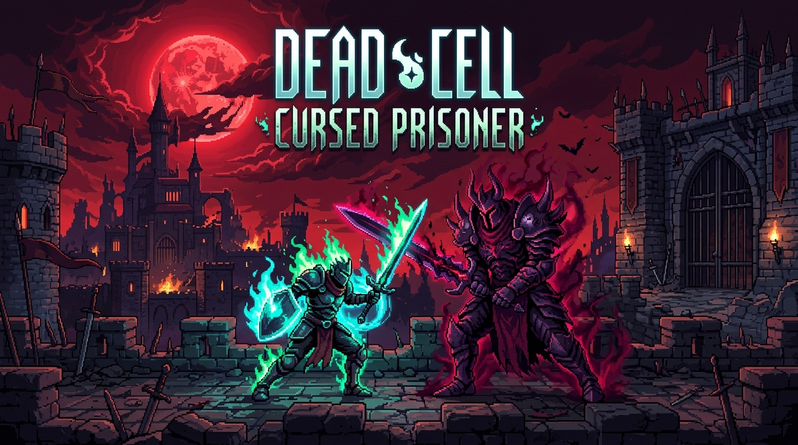
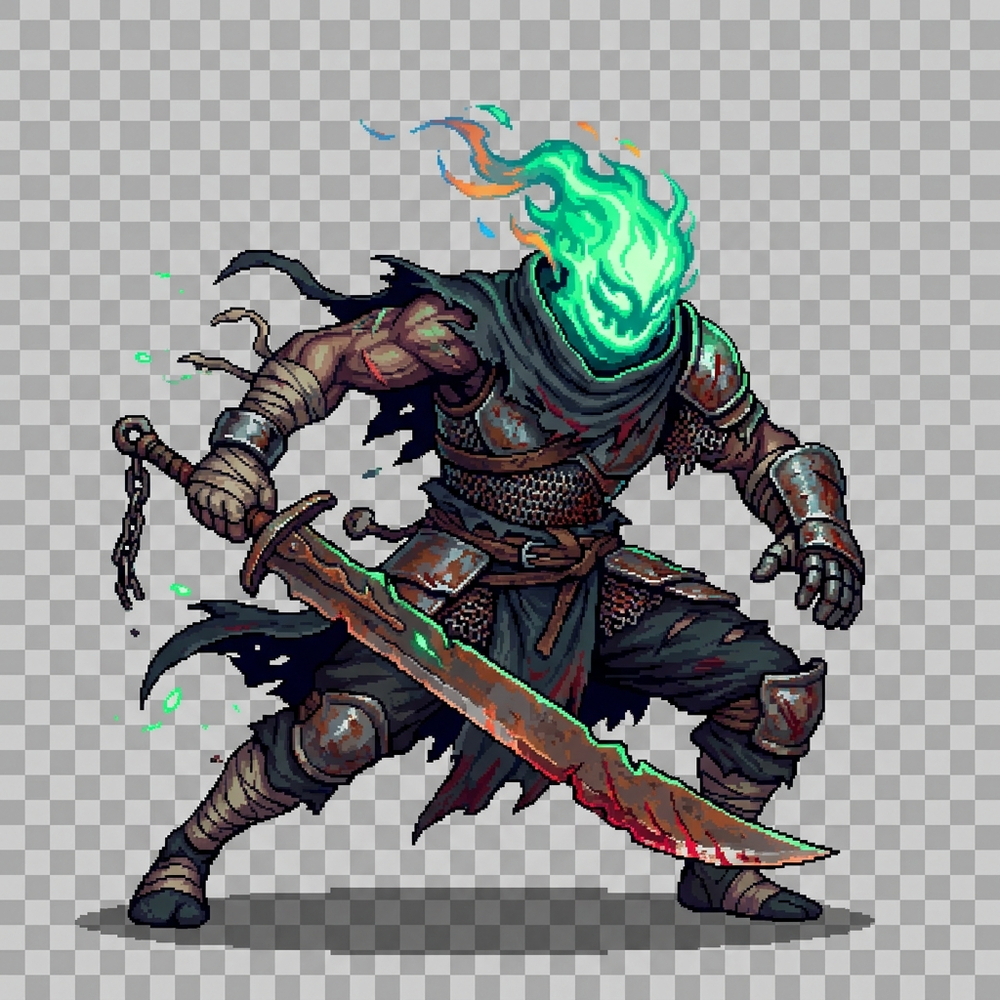
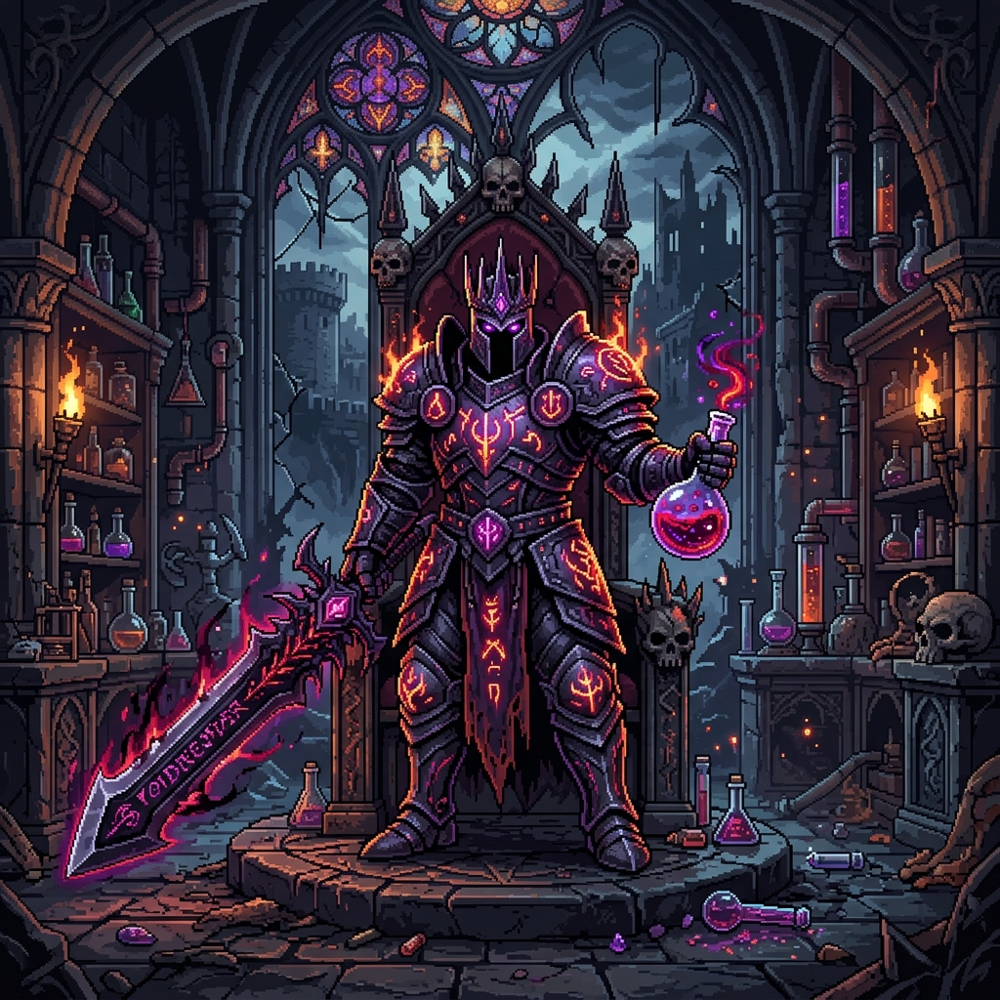
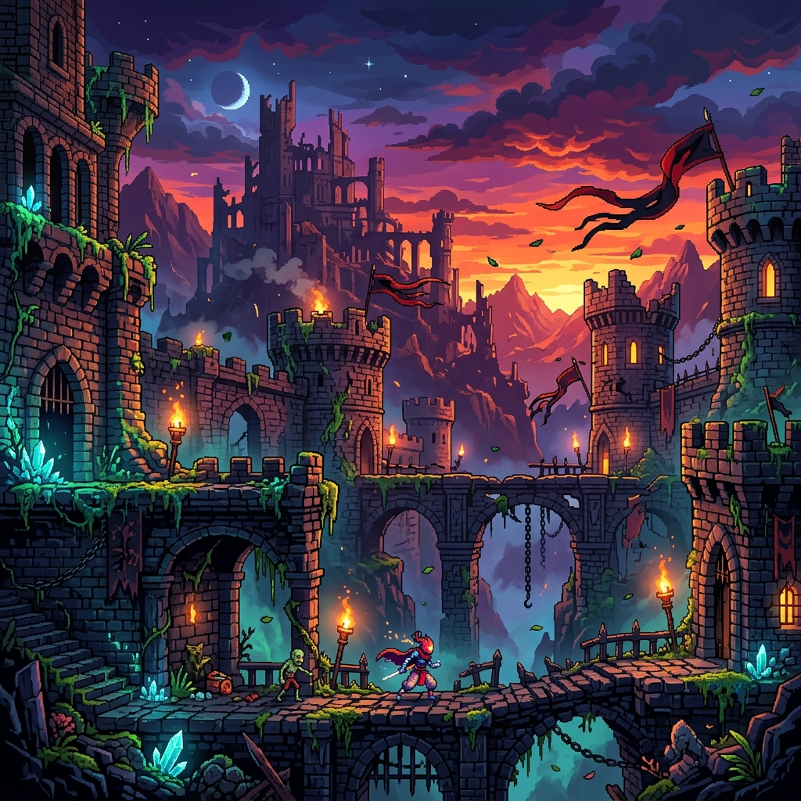

<p align="center">
  
</p>

<h1 align="center">🗡️ DEAD CELL: CURSED PRISONER</h1>

<p align="center">
  <strong>2D Fast-Paced Action-RPG & Roguelite Web Game</strong><br>
  Terinspirasi dari gameplay dinamis <em>Dead Cells</em> — pertarungan hack-and-slash intens, eksplorasi dungeon berliku, sistem upgrade status RPG, dan pertarungan boss multi-fase!
</p>

<p align="center">
  
  
  
  
</p>

---

## 📖 Tentang Game

**Dead Cell: Cursed Prisoner** adalah game aksi platformer 2D yang berjalan langsung di web browser. Anda bermain sebagai sang tawanan terkutuk (*The Beheaded*) yang harus membelah lorong-lorong dungeon berbahaya, mengumpulkan sel dan emas dari monster, membeli persenjataan legendaris, dan mengalahkan penguasa tirani alkimia, **Lord Malakor**.

<br>

<div align="center">
  <table>
    <tr>
      <td width="50%" align="center">
        
        <br><strong>🗡️ The Cursed Prisoner</strong>
      </td>
      <td width="50%" align="center">
        
        <br><strong>👑 Lord Malakor (Final Boss)</strong>
      </td>
    </tr>
  </table>
</div>

---

## 🎮 Kontrol Game (Controls)

| Tombol / Mouse | Aksi | Deskripsi |
| :--- | :--- | :--- |
| **A / D** atau **◄ / ►** | **Bergerak** | Berlari ke kiri atau ke kanan |
| **W** / **Space** / **▲** | **Lompat** | Lompat biasa & **Double Jump** di udara |
| **S + Space** (di udara) | **Down-Smash** | Menghantam tanah dengan getaran layar & ledakan AoE |
| **Shift** / **K** | **Dodge Roll** | Berguling cepat (*i-frames* kebal serangan musuh) |
| **J** / **Klik Kiri** | **Primary Attack** | Kombo 3-serangan pedang cepat & peluang Critical |
| **K** / **Klik Kanan** | **Secondary Attack** | Serangan jarak jauh (Frost Bow, Electric Whip, Kunai) |
| **Q** | **Skill 1** | Melempar *Cluster Grenade* / *Phaser Strike* |
| **E** | **Skill 2** | Membekukan musuh (*Frost Blast*) / pasang *Sinew Turret* |
| **R** | **Health Flask** | Meminum ramuan penyembuh darah |
| **F** | **Interaksi** | Bicara ke NPC, buka Peti, aktifkan Checkpoint, ganti Senjata |
| **ESC** | **Tutup Menu** | Menutup jendela dialog toko & panduan kontrol |

---

## 🏰 Eksplorasi Dungeon & Lingkungan

<p align="center">
  
</p>

### 🗺️ Stage & Level:
1. **Stage 1: Prisoners' Quarters** — Lorong bawah tanah suram penuh jebakan duri, zombi pemotong, pemanah tengkorak, dan pedagang *Goblin Merchant*.
2. **Stage 2: The Ramparts** — Puncak menara benteng terjal di kala senja, lompatan jurang berisiko, musuh berperisai baja, iblis *Phaser* bertaring kilat, dan altar suci *The Collector*.
3. **Stage 3: Crypt of the Sovereign** — Arena takhta gothic megah tempat bertarungnya sang penguasa kegelapan, Boss Lord Malakor.

---

## ✨ Fitur-Fitur Unggulan

### ⚔️ 1. Fast-Paced Combat & Rally Mechanic
- **Rally HP Recovery**: Ketika terkena damage musuh, sebagian HP berubah menjadi oranye (*Rally Bar*). Balas serang musuh dengan cepat sebelum bar habis untuk merebut kembali HP!
- **Juicy Combat Feel**: Dilengkapi *Screen Shake*, *Hit-stop freeze*, percikan darah, efek partikel bara api, dan *Floating Damage Numbers*.

### 👑 2. Pertarungan Boss Multi-Fase: Lord Malakor
- **Fase 1**: Tebasan pedang raksasa & gelombang kejut *Shockwave Ground Slam*.
- **Fase 2 (HP < 65%)**: Hujan ramuan alkimia beracun (*Alchemical Storm*) & semburan api ungu.
- **Fase 3 (HP < 30%)**: Mode *Chaos Overdrive* berkecepatan tinggi dengan rentetan proyektil laser energi.

### 🪙 3. Ekonomi, Loot & Status RPG
- Kalahkan musuh untuk mendapatkan **Gold** dan **Dead Cells**.
- Kumpulkan **Scroll of Power** untuk meningkatkan 3 cabang status:
  - ⚔️ **Brutality**: Peningkatan damage jarak dekat & HP.
  - 🏹 **Tactics**: Peningkatan damage jarak jauh & reduksi cooldown skill.
  - 🛡️ **Survival**: Peningkatan maksimal HP & efektivitas Health Flask.
- Buka peti harta karun untuk menemukan senjata ber-tier tinggi (*Tier I - V*).

### 🧙‍♂️ 4. Interaksi NPC & Toko
- **Goblin Merchant**: Menjual berbagai macam senjata unik (*Vorpan of Doom*, *Hattori Blood Katana*) serta isi ulang botol ramuan.
- **The Collector**: Menempa upgrade permanen (*Max Flask Charges*, *Weapon Tier Forge*, *Brutality Rune*) dengan menukarkan Dead Cells.

### 🔮 5. Sistem Checkpoint & Respawn
- Aktifkan kristal checkpoint teleportasi untuk memulihkan seluruh HP, mengisi ulang Flask, dan menyimpan titik hidup.
- Saat gugur (*YOU DIED*), pemain dapat langsung bangkit kembali di checkpoint terakhir tanpa harus mengulang dari awal.

### 🔊 6. Procedural Audio & Dynamic BGM
- Musik latar dinamis dan sound effect sintetis yang dibangun menggunakan **Web Audio API** native (tidak memerlukan file audio eksternal).

---

## 🚀 Cara Menjalankan Game

1. **Clone repositori ini:**
   ```bash
   git clone https://github.com/username/dead-cells-rpg.git
   cd dead-cells-rpg
   ```

2. **Jalankan Game:**
   - Cukup buka file `index.html` langsung di browser favorit Anda (Google Chrome, Microsoft Edge, Mozilla Firefox, dll).
   - Atau jalankan web server lokal:
     ```bash
     # Menggunakan Python
     python -m http.server 3000

     # Atau menggunakan Node.js (npx serve)
     npx serve .
     ```
   - Buka `http://localhost:3000` di browser.

3. Klik tombol **"MULAI PETUALANGAN"** dan nikmati pertarungan! 🎮🔥

---

## 📜 Lisensi & Atribusi

Proyek ini dibuat untuk tujuan edukasi dan hiburan, terinspirasi dari mahakarya *Dead Cells* oleh Motion Twin. 

Distributed under the **MIT License**.
